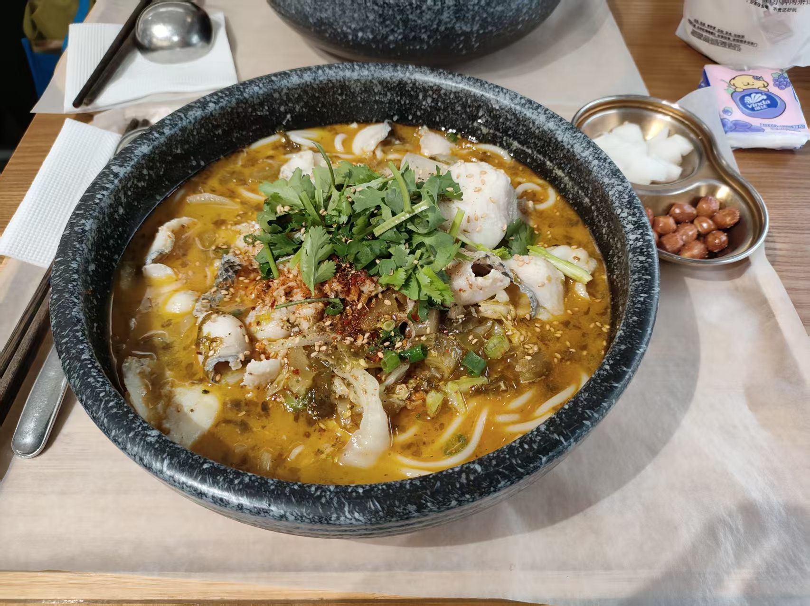
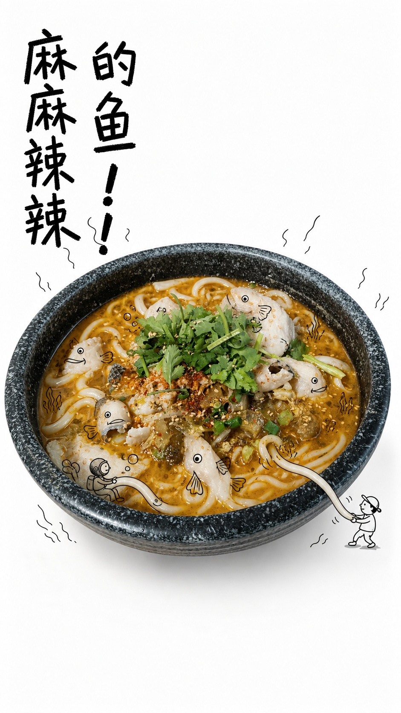
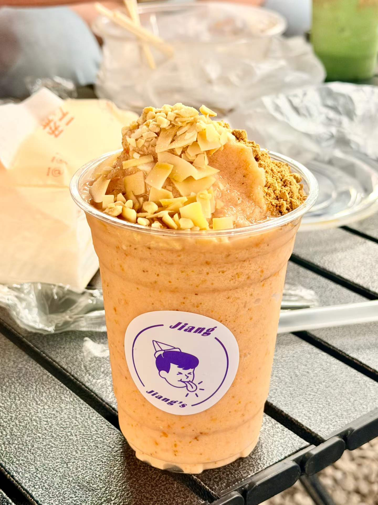
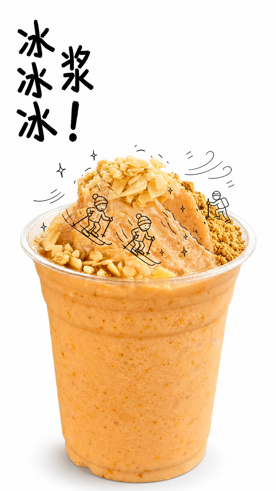
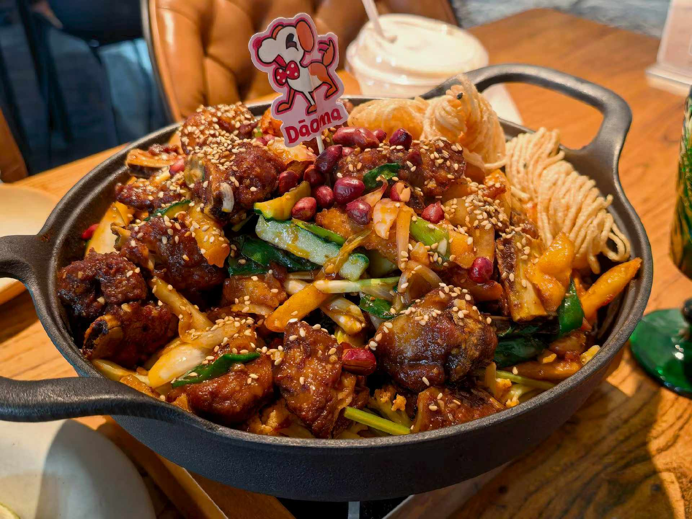
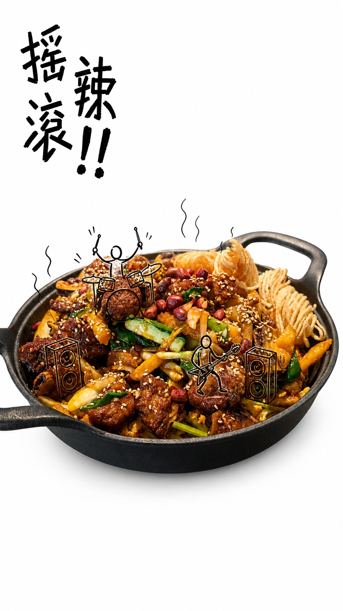

# heytea-style

> 把一张普通食品照片，变成纯白背景、真实食物与童趣手绘叙事结合的 9:16 宣传海报。


`heytea-style` 是一个面向 Codex 的图片生成 Skill。它保留原图中食品与容器的真实质感，把最有表现力的食物结构变成一段稚拙、活泼的黑线小故事，再为海报生成两款固定的儿童手写标题。

- **F：粗版**——非惯用手蜡笔感，粗粝、有颗粒、歪斜有冲劲。
- **I：细版**——认真儿童硬笔感，细而犹豫、松散、不规整。
- **背景固定为纯白 `#FFFFFF`**，不使用米白、暖灰、纸纹或渐变。
- 用户输入 `/` 时，只生成无配文海报。

> **非官方项目声明：** 本项目独立开发，与喜茶 HEYTEA 或任何餐饮品牌无隶属、合作、授权或背书关系。示例照片中偶然出现的第三方名称或标识归其权利人所有，不作为本项目的可复用品牌资产提供。

如果这个 Skill 对你有帮助，欢迎点一个 **Star**，也欢迎分享你生成的食品海报。

## 效果展示

以下均为本 Skill 的真实输入与生成结果。左侧是原图，右侧是 F 粗蜡笔字体成品；同一底图还可输出 I 细儿童硬笔版本。

### 1. 麻麻辣辣的鱼！！

鱼片与面条被转化为水下游乐场，真实汤色、鱼片、香菜与石纹碗仍然清晰可见。

<table>
  <tr>
    <th width="50%">原图</th>
    <th width="50%">生成结果</th>
  </tr>
  <tr>
    <td align="center"></td>
    <td align="center"></td>
  </tr>
</table>

### 2. 冰冰冰浆！

冰沙山丘、椰片与坚果碎共同组成滑雪场；杯型、冰沙颗粒和配料层次保持真实。

<table>
  <tr>
    <th width="50%">原图</th>
    <th width="50%">生成结果</th>
  </tr>
  <tr>
    <td align="center"></td>
    <td align="center"></td>
  </tr>
</table>

### 3. 摇滚辣！！

一锅香辣食物变成小型摇滚现场：锅中的真实食材仍是主角，鼓手、吉他手与音箱只负责把气氛推高。

<table>
  <tr>
    <th width="50%">原图</th>
    <th width="50%">生成结果</th>
  </tr>
  <tr>
    <td align="center"></td>
    <td align="center"></td>
  </tr>
</table>

## 它解决什么问题

普通的“加几笔涂鸦”容易出现三个问题：食物被画面盖住、涂鸦与食物结构无关、中文标题不稳定。这个 Skill 把三者拆开处理：

1. **食物是视觉真相**：锁定容器、视角、配料、光泽、纹理和不规则细节。
2. **手绘必须借形**：只选择一个最有感染力的食物部位进行高覆盖叙事，真实表面仍然可见。
3. **标题独立生成**：F 与 I 两款标题分别生成、逐字检查，再本地合成。
4. **一次底图，两款字体**：不会为了换字体而重复生成食物主体，减少等待与风格漂移。

## 快速开始

### 1. 安装 Skill

将 `skills/heytea-style` 复制到 Codex 的个人 Skill 目录。

Windows PowerShell：

```powershell
$target = Join-Path $env:USERPROFILE ".codex\skills\heytea-style"
New-Item -ItemType Directory -Force -Path $target | Out-Null
Copy-Item -Recurse -Force .\skills\heytea-style\* $target
```

macOS / Linux：

```bash
mkdir -p ~/.codex/skills/heytea-style
cp -R ./skills/heytea-style/. ~/.codex/skills/heytea-style/
```

本地合成脚本需要 Python 3.10+ 与 Pillow：

```bash
python -m pip install -r requirements.txt
```

### 2. 在 Codex 中使用

上传食品或饮品照片，然后输入：

```text
$heytea-style 请把这张照片做成白底童趣手绘宣传图。
```

Skill 会询问：

```text
请输入海报配文（输入 / 表示不需要配文）：
```

例如：

```text
冰冰冰浆！
```

最终会得到：

- `F`：粗蜡笔儿童字体版；
- `I`：细儿童硬笔字体版；
- 输入 `/`：无标题版。

## 设计原则

| 维度 | 固定规则 |
| --- | --- |
| 画布 | 静态 9:16 竖版 |
| 背景 | 纯白 `#FFFFFF` |
| 主体 | 保留原食品、容器、视角、配料与纹理 |
| 主叙事 | 在一个最有表现力的真实食物表面进行高覆盖黑线手绘 |
| 辅助线 | 少量蒸汽、速度、闪光、晃动或冲击线 |
| 字体 | 仅使用 F 粗蜡笔体与 I 细儿童硬笔体 |
| 文案 | 严格使用用户原文与标点；`/` 表示无文案 |
| 禁止项 | 官方 Logo、二维码、水印、价格、营养或来源等未经证实的宣传信息 |

## 工作流程

```text
临时图片
   ↓ 稳定暂存与一次检查
主体锁定 + 文案确认 + 手绘故事选择
   ├── 无字纯白底海报
   ├── F 粗蜡笔标题
   └── I 细硬笔标题
             ↓
      逐字校验与一次本地合成
             ↓
       F / I 两张最终海报
```

三条生成分支可以并行执行。任一分支失败时，只重试失败部分，不会丢弃已经合格的底图或标题。

## 仓库结构

```text
.
├── .github/workflows/test.yml
├── assets/examples/               # README 前后对比图
├── skills/heytea-style/
│   ├── SKILL.md
│   ├── agents/openai.yaml
│   ├── assets/                    # F / I 字体参考图
│   ├── references/                # 风格、字体与提示词规范
│   └── scripts/                   # 输入暂存与本地合成
├── tests/test_scripts.py
├── LICENSE
├── README.md
└── requirements.txt
```

## 测试

```bash
python -m unittest discover -s tests -v
```

测试覆盖输入暂存缓存、F/I 字体资产存在性、双版本合成与最终画布尺寸。

## 适用范围与限制

- 适合食品、饮品、甜品、早餐、小吃与餐厅菜品的静态宣传图。
- 输入图越清晰、主体越集中，容器和配料还原越稳定。
- 生成模型仍可能偶尔写错复杂中文；Skill 会要求逐字检查，并只重试错误标题。
- 本项目不生成 GIF、LIVE Photo、视频或动画，除非另行扩展。
- 发布或商用前，请确认输入照片、字体参考资产与生成结果的使用权。

## 参考与兼容性

本项目采用自包含的 Agent Skill 目录结构。关于 Skills 的设计与使用，可参考：

- [Anthropic Agent Skills](https://github.com/anthropics/skills)
- [GitHub Awesome Copilot](https://github.com/github/awesome-copilot)
- [GitHub Docs: About agent skills](https://docs.github.com/en/copilot/concepts/agents/about-agent-skills)

README 的信息结构参考了高关注度 Skill 项目常用的“先展示价值与结果，再给快速安装、工作原理和贡献入口”的组织方式。

## License

[MIT License](LICENSE) © 2026 Guoba loves potatoes

## 贡献

欢迎通过 Issue 提交失败案例、字体改进建议与新的食品借形创意，也欢迎提交 Pull Request。请勿贡献没有授权的品牌 Logo、商业字体或第三方图片。
